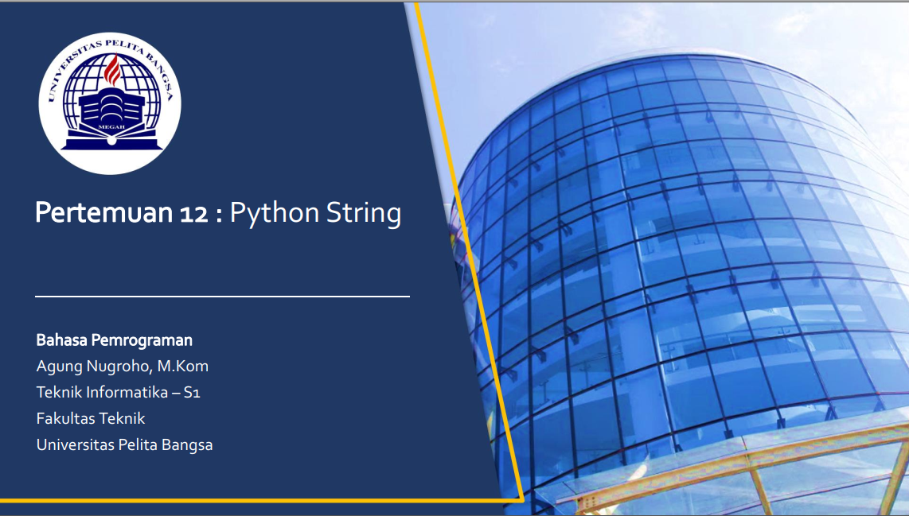
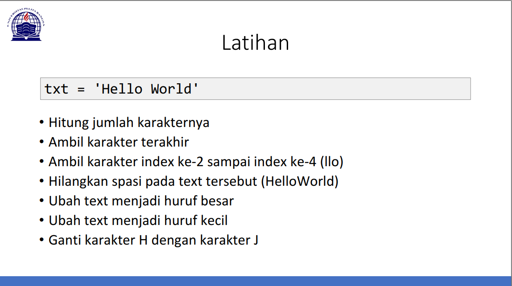
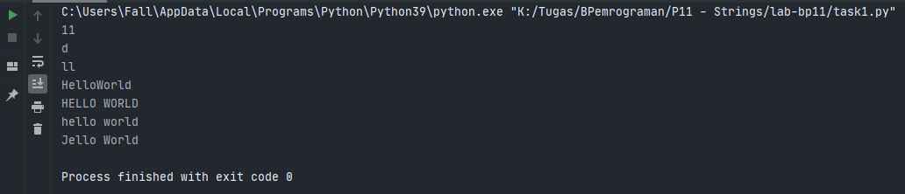

# Lab-12
Repository ini dibuat untuk pemantapan materi pada modul materi di pertemuan-12 <br>
<pre>
Nama    : Naufal Nirwansyah 
Kelas   : TI.20.A1
NIM     : 312010174
Dosen   : Agung Nugroho S.Kom, M.Kom
</pre>
***
<div align="center">

</div> <br>

Pada pertemuan 12 yang lalu saya mendapat 2 latihan untuk pemantapan materi yang diberikan oleh
dosen pengampu *Bahasa Pemrograman* **Bpk. Agung Nugroho S.Kom, M.Kom** <br>

**Berikut ini tugas pertama yang terdapat didalam modul materi **Strings** :** <br>

<div align="center">

</div> <br>

Untuk mengerjakan task diatas diatas sesuai dengan opsi khusus dibawahnya, saya dengan source code sebagai berikut: <br>

```
txt = 'Hello World'

print(len(txt))
print(txt[10:11])
print(txt[2:4])
print(txt.replace(' ',''))
print(txt.upper())
print(txt.lower())
print(txt.replace('H','J'))
```
<br>

<p style="text-align:center;"> ***Output dari Source Code Diatas*** </p>

<br>

<div align="center">

</div> <br>

***
## Penjelasan

- .

- .

- . 

- .

- .

***